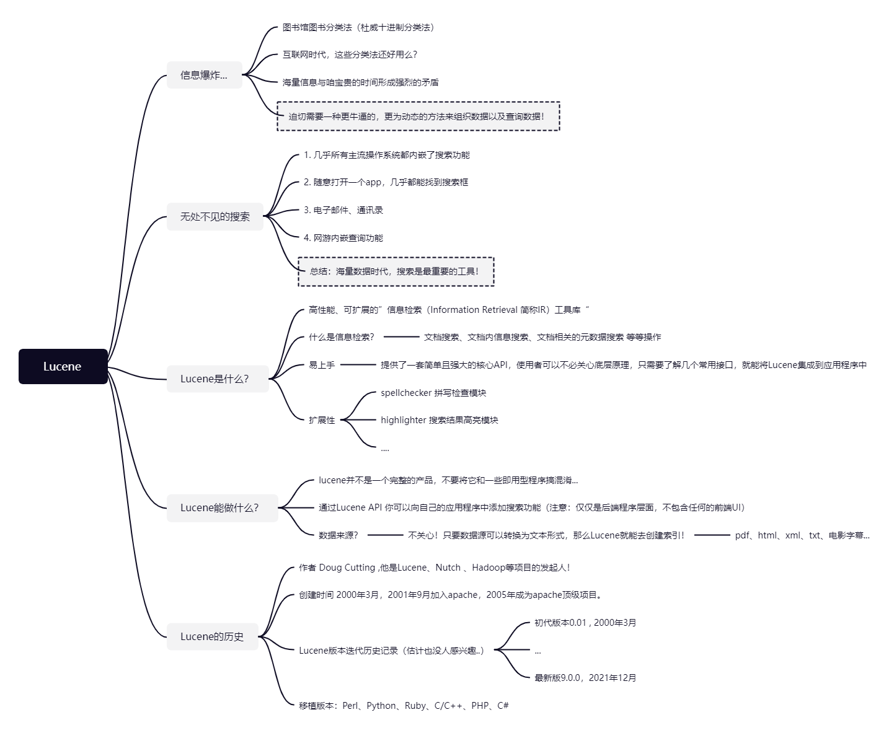
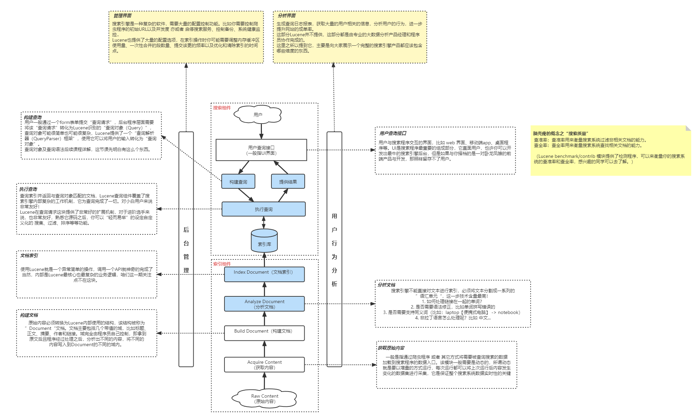
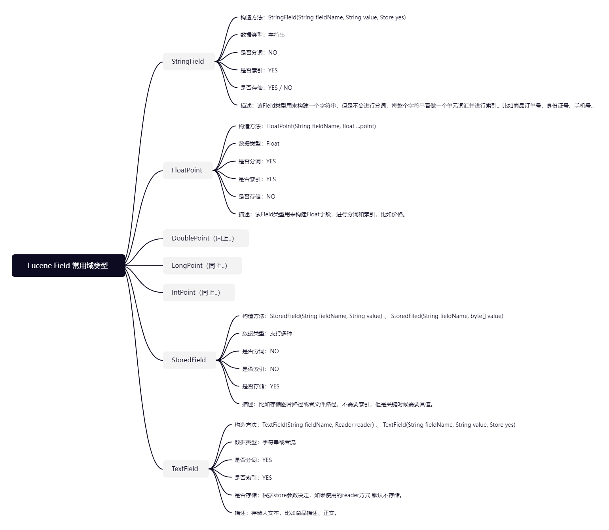
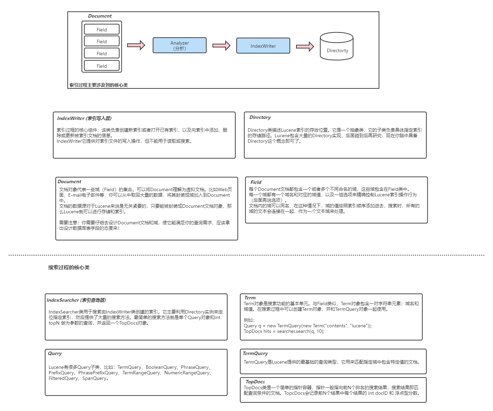
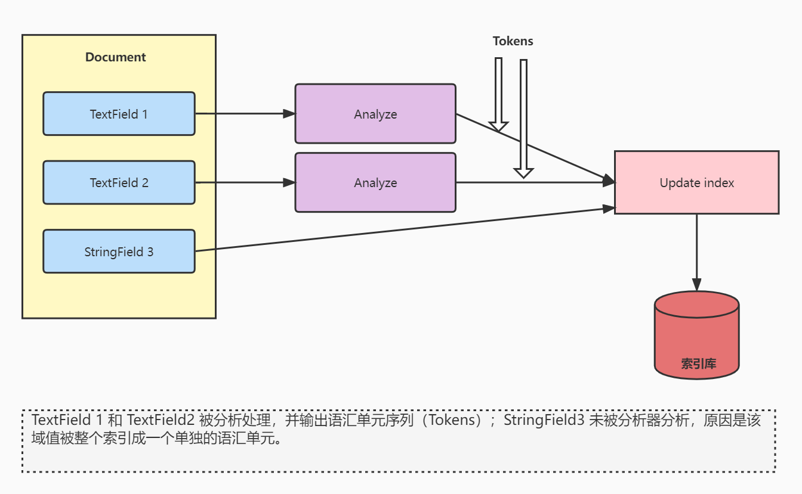
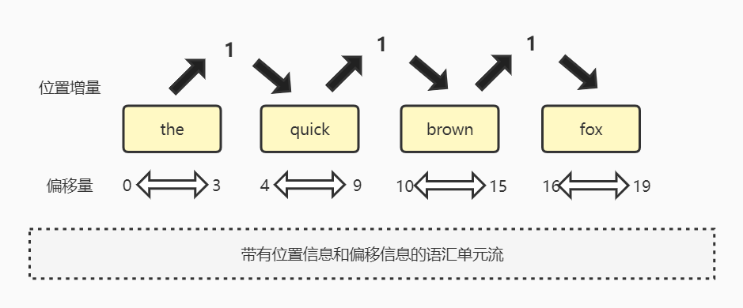

# lucene学习笔记

> 源码  [idea_search](lucene学习笔记.assets/idea_search) 


## 背景



## 搜索引擎组件



## 索引和域


###  **Lucene Field 域类型**





### **索引和搜索的核心类**

- `Document` : 文档

- `Field` : 域

- `IndexWriter` : 索引写入器

- `Directory` : 索引文档 

  ---

- `IndexSearch` :  索引查询器

- `Term` : 搜索功能的基本单元

- `Query` : 查询接口

- `TermQuery` : 基础查询类型

- `TopDocs` : 指针容器，用来接收返回值 




### 索引的增删改查

```markdown
->向索引增加文档
添加索引的方法有两个：
1. indexWriter.addDocument(Document doc)
    使用默认分析器添加文档，该分析器在创建indexWriter对象时指定，用于语汇单元分析操作。

2. indexWriter.addDocument(Document doc, Analyzer analyzer)
    使用指定的分析器添加文档和语汇单元分析操作。 (注意：新版本不支持该API接口)
（分析Demo1添加文档）
关闭writer或者显示调用writer.commit()都会将缓冲区内的索引数据落盘。

->删除文档
大部分情况大家更关注如何将文档加入到Lucene索引中，但是也有部分例外，比如下面这种情况。
例：某资讯平台只保留半月内的最新资讯，需要将过期的资讯全部删除。
还有一些程序需要删除包含某一项的全部文档，都可以通过IndexWriter提供的方法来从索引中删除文档。
1. indexWriter.deleteDocuments(Term term) 负责删除包含项的所有文档。
2. indexWriter.deleteDocuments(Term[] terms) 负责删除包含项数组任一元素的所有文档。
3. indexWriter.deleteDocuments(Query query) 负责删除匹配查询语句的所有文档。
4. indexWriter.deleteDocuments(Query[] querys) 负责删除匹配查询语句数组任一元素的所有文档。
5. indexWriter.deleteAll() 负责删除索引中全部文档。

如果需要通过Term删除单个文档，需要确认文档在索引时索引了指定Field字段，还需要确认该Field域字段值
都是唯一的，才可以将该文档单独定位出来并删除。概念类似于数据库中的主键，需要注意该域需要设置为“不分析”的域，
保证分析器不会将它分解成语汇单元。
例：writer.deleteDocuments(new Term("id", documentId))
注意：调用该方法时一定要谨慎，如果不小心创建了错误的Term对象（被分词的域，可能关联很多文档），那么Lucene
将删除索引中与该Term命中的全部文档。
删除操作并不会立即执行，而是会存放在缓冲区内，与加入文档类似，最后Lucene会通过周期性刷新文档目录来执行该操作。
也可以通过writer.commit() 或者 writer.close() 来立即生效。即使删除操作已经完成，物理磁盘上的文件也不会立即
删除，Lucene只是将被删除的文档标记为“删除”，待索引段合并时会进行真正的物理删除。
（分析Demo1删除文档）

->更新索引中的文档
更新已索引的文档这个需求很常见，比如你的搜索系统依赖的源数据进行的更新，那么相对应的索引就必须进行更新，
否则搜索系统的搜索准确度会降低。某些情况下，仅仅是文档的某个域需要更新，如产品名称发生了变化，但是正文
未变化，非常遗憾，尽管该需求很普遍，但是Lucene做不到。Lucene只能删除整个过期文档，然后再向索引中添加
新文档。这要求新文档必须包含旧文档的所有域，包括内容未发生改变的域。
IndexWriter 提供了1个API来更新索引中的文档
    indexWriter.updateDocument(Term term, Document newDoc)
    第一步 删除term匹配的文档，第二步 使用writer再添加文档。
例：writer.updateDocument(new Term("id", documentId), newDocument)
注意：由于updateDocument方法在后台会调用deleteDocuments方法，一定要确定Term标识的唯一性。
（分析DemoUpdateDocument）
```

### 域类型

```
老版本中Lucene并没有提供许多内置类型的Field，而是统一使用原生Field类型。
代码例如：注意，这些代码都不能在新版本Lucene使用了，有更好的方式。
// 存储，不分词 且 不存储NORMS（加权基准）
doc.add(new Field("id", ids[i], Field.Store.YES, Field.Index.NOT_ANALYZED_NO_NORMS));
// 存储，不分词
doc.add(new Field("author", authors[i], Field.Store.YES, Field.Index.NOT_ANALYZED));
// 存储，进行分词
doc.add(new Field("title", titles[i], Field.Store.YES, Field.Index.ANALYZED));


|--------------|--------------|--------------|--------------|--------------|------------------------------------------|
    Filed类          数据类型        是否分词        是否索引        是否存储                        说明
|--------------|--------------|--------------|--------------|--------------|------------------------------------------|
|  StringField |     字符串    |      No      |      Yes     |     Y/N      |  用来构建一个字符串Field，但是不会进行分词，会将整个串当做一个“语汇单元”存储到索引中，比如“订单号”“身份证号”，是否存储原值由参数 Store 决定
|  LongPoint   |    Long型    |      Yes     |       Yes    |      Y/N     |   用来构建一个Long型Field，进行分词和索引，比如“价格”。是否存储在文档中由Store决定
|  StoredField |    多种类型   |      No      |       No     |      Yes     |   不分析，不索引，但是Field会存储在文档中
|  TextField   |    字符串或流  |      Yes     |      Yes     |      Y/N     |  如果值参数是Reader，Lucene猜测值比较大，会采用Unstored策略
|--------------|--------------|--------------|--------------|--------------|------------------------------------------|

->Reader、TokenStream、byte[]域值
TextField(String name, Reader reader, Store store)
该构造方法使用Reader而非String来表示域值，在这种情况下域值是不能被存储的（域存储选项被硬编码为Store.NO），并且该域将用于分析和索引。
如果在内存中保存String代价比较高或者不太方便时，如存储的域值比较大，请使用这个初始化方法。

TextField(String name, TokenStream tokenStream)
TokenStream 用来表示一组已分析过的语汇单元，Analyze分析器内部也是使用的TokenStream来表示分析过的语汇单元列表，
可以这样理解，不使用IndexWriter进行分析了，提前一步将“内容”分析过了，分析过的内容由 TokenStream 引用。

StringField(String name, ByteRef byteRef, Store store)
  BytesRef(byte[] bytes, int offset, int length)
这种域不会被索引，只会做存储。注意，Store在底层会强设YES。一般很少用..
```

|   Filed类   |  数据类型  | 是否分词 | 是否索引 | 是否存储 | 说明                                                         |
| :---------: | :--------: | :------: | -------- | -------- | :----------------------------------------------------------- |
| StringField |   字符串   |    No    | Yes      | Y/N      | 用来构建一个字符串Field，但是不会进行分词，会将整个串当做一个“语汇单元”存储到索引中，比如“订单号”“身份证号”，是否存储原值由参数 Store 决定 |
|  LongPoint  |   Long型   |   Yes    | Yes      | Y/N      | 用来构建一个Long型Field，进行分词和索引，比如“价格”。是否存储在文档中由Store决定 |
| StoredField |  多种类型  |    No    | No       | Yes      | 不分析，不索引，但是Field会存储在文档中                      |
|  TextField  | 字符串或流 |   Yes    | Yes      | Y/N      | 如果值参数是Reader，Lucene猜测值比较大，会采用Unstored策略   |


### 加权


```
-> 域加权
所谓域加"权"，就是根据需求的不同，对不同的关键值或者不同的关键索引分配不同的权值，因为查询的时候Lucene的评分机制和权值的高低是成正比的，
这样权值高的内容更容易被用户搜索出来，而且排在前面。
field.setBoost(float boost)


-> 文档加权（4.x之后Lucene取消了文档加权，想实现文档加权就让文档的所有域一起加权）
假设有这样的需求，你为公司设计Email索引程序，该程序可能要求在进行索引结果排序时，公司员工的Email能排在其他Email前面位置。
如何实现呢？
其实很简单，默认情况下，所有文档都没有加权值（或者说 加权值 都是 1.0）。通过修改文档的加权因子，你就能指示Lucene在计算相关性
时或多或少的考虑到该文档针对其他文档的重要程度。
document.setBoost(float boost)
(文档加权demo)

```

```java

public class Demo2 {

    public static void main(String[] args) throws Exception {
        Demo2 demo = new Demo2();

        demo.index();
        demo.search();
    }

    // 写测试数据，这些数据是写到索引文档里去的。
    private String ids[] = { "1", "2", "3", "4" }; // 标示文档
    private String author[] = { "Jack", "Mary", "Jerry", "Machech" };
    private String title[] = { "java of china", "Apple of china", "Androw of apple the USA", "People of Apple java" }; //
    private String contents[] = {
            "java  of China!the world the why what",
            "why a dertity compante is my hometown!",
            "Jdekia ssde hhh is a beautiful city!",
            "Jdekia ssde hhh is a beautiful java!" };

    private Directory dir = new RAMDirectory();

    /**
     * 获取IndexWriter实例
     * 
     * @return
     * @throws Exception
     */
    private IndexWriter getWriter() throws Exception {

        // 实例化分析器
        Analyzer analyzer = new StandardAnalyzer();

        // 实例化IndexWriterConfig
        IndexWriterConfig con = new IndexWriterConfig(analyzer);

        // 实例化IndexWriter
        IndexWriter writer = new IndexWriter(dir, con);

        return writer;
    }

    /**
     * 生成索引（对应图一）
     * 
     * @throws Exception
     */
    public void index() throws Exception {

        IndexWriter writer = getWriter();

        for (int i = 0; i < ids.length; i++) {

            Document doc = new Document();

            doc.add(new StringField("id", ids[i], Field.Store.YES));
            doc.add(new StringField("author", author[i], Field.Store.YES));
            // 加权操作
            TextField field = new TextField("title", title[i], Field.Store.YES);

            /*
             * if("Jerry".equals(author[i])){
             * 
             * //设权 默认为1
             * field.setBoost(1.5F);
             * }
             */

            doc.add(field);
            doc.add(new StringField("contents", contents[i], Field.Store.NO));

            // 添加文档
            writer.addDocument(doc);
        }

        // 关闭writer
        writer.close();
    }

    public void search() throws Exception {

        // 通过dir得到的路径下的所有的文件
        IndexReader reader = DirectoryReader.open(dir);

        // 建立索引查询器
        IndexSearcher searcher = new IndexSearcher(reader);

        // 查找的范围
        String searchField = "title";

        // 查找的字段
        String q = "apple";

        // 运用term来查找
        Term t = new Term(searchField, q);

        // 通过term得到query对象
        Query query = new TermQuery(t);

        // 获得查询的hits
        TopDocs hits = searcher.search(query, 10);

        // 显示结果
        System.out.println("匹配 '" + q + "'，总共查询到" + hits.totalHits + "个文档");

        // 循环得到文档，得到文档就可以得到数据
        for (ScoreDoc scoreDoc : hits.scoreDocs) {

            Document doc = searcher.doc(scoreDoc.doc);

            System.out.println(doc.get("author"));
        }

        // 关闭reader
        reader.close();
    }

}

```


### 数值索引与段合并


**数值索引**


```
-> 索引数字
程序处理数字有两个截然不同的场景。
场景一：数字内嵌在将要索引的文本中，需要将数字视为单独的语汇单元来处理。这样就可以在随后的搜索程序中实现查找数字筛选文档。
例如 “Be sure to include From 1099 in your tax return.” 你希望能搜索到数字“1099”，就像搜索 “tax” 一样。
实现该功能非常简单，只需要提供一个不丢弃数字的分析器即可，比如 “WhitespaceAnalyzer” “StandardAnalyzer”，它们都会将数字
当做单独的语汇单元来处理。

场景二：文档中特定域只包含数字，而你希望将他们作为数字域值来索引，并能在搜索和排序中对它们进行精确匹配。
例如 产品列表中每一款产品都有价格字段，你希望在搜索功能支持按照价格区间来搜索产品。

在老版本Lucene（2.9之前），并不能很好的支持数字索引，需要特别处理数字，采用补0的手段。
问题：不进行补0有什么问题？
比如有 123456，123，222 被当做普通语汇单元来处理，在进行范围搜索“TermRangeQuery” [123,222]，
会将 123456,123,222 全部查询出来，很明显“123456”不应该被定位出来..
因为Lucene索引语汇单元的顺序是按照字典序来的（上层是一个跳跃表结构），最终索引的顺序为 123,123456,222
采用补0方案之后这些数字转换为了：000123456，000000123,000000222
这样的话最终索引的顺序就成为了：000000123,000000222,000123456
该方案虽然也能完成范围查询的需求，但是很明显“性能很烂”。如果我的搜索范围比较大[000000123,000000222]，
内部其实是将范围查询 转换为 多个 Term 查询，然后再做的合并。
再一个缺点，你很难预测到底补多少个0才能满足日后需求。

在新版本Lucene，已经可以很好的支持数字索引了，IntPoint LongPoint FloatPoint DoublePoint 这些Field类型来支持不同精度的数值域。
通过将数字转化为一些字符串来完成的索引，比如 num1 拆解成 a ab abc   num2 拆解成 a ab abd。
|------------|------------|
|     num1   |     num2   |
|------------|------------|
| a ab abc   | a ab abd   |
|------------|------------|
通过搜索ab 可以把带ab 前缀的num1,num2 都找出来。在范围查找的时候，查找范围内的数值的相同前缀可以达到一次查找返回多个doc 的目的，从而减少查找次数。
至于如何将数值转化为对应的 字符串组合，这点大家可以去查阅下资料或者源码。底层其实是通过 位 来计算出来的，咱们基础课先不纠结这么多了，有个了解就成了。


-> 索引日期和时间
该问题其实和索引数字是一个问题。你可以将日期和时间转换为等价的数值。
doc.add(new LongPoint("timestamp", new Date().getTime()));
```


**域截取**

```markdown
添加索引文档时，很有可能某个文档的正文特别长，导致Lucene分析过程比较费时。此时你可能只想对文档
中的部分内容进行索引。比如说 只对文档的前200个单词进行索引。
为了支持该需求，IndexWriter允许你对域进行截取后再索引它们。实例化IndexWriter之后，在向其提供
MaxFieldLength实例去控制截取数量。MaxFieldLength有两个默认的实例（MaxFieldLength.UNLIMITED / MaxFieldLength.LIMITED），
MaxFieldLength.UNLIMITED：不采取截取策略，该策略。
MaxFieldLength.LIMITED：只截取域中前1000个项。
当然你也可以自己去实例化MaxFieldLength去控制截取长度。需要注意的一点是，域截取意味着程序会忽略一部分文档文本，会使得
这些文本无法通过Lucene来搜索，从而让用户感到困惑，所以使用域截取功能时一定要谨慎，或者只有在真正有必要时再使用它。
```


**段合并**

```
-> 分段存储
早期全文检索工具为全部文档维护一个很大的索引结构，并将其存入磁盘。如果有更新操作，那么就全量重建
该索引结构。该方式很明显不再适合当今时代，你必须要清楚重建索引的成本是最高的！至于为什么不能修改原
索引结构，你可以想象一下“在黑板上已经写好的一篇课文，现在要向其中间插一句话”，有几种方案？
1. 空白的角落写一句话，然后告诉同学们
2. 这句话后面的字全部擦掉，然后插进去，再将后面的那些被擦掉的字写到“新插”后面。
Lucene采用的方案类似方案2，选择的重建索引。方案1看似虽好，但是随着时间的流逝熵会越来越大，不利于搜索内核程序。

现在Lucene引入了“索引分段”的技术，即将一个索引文件拆分为多个子索引文件。每个段都是一个独立的可被搜索的数据集，
并且段具有不变性，一旦写入磁盘，就不能再发生改变。

分段策略下，索引的写入过程如下：
1. 新增。当有新的数据需要创建索引时，由于段的不变性，所以选择新建一个段来存储新增的数据。
（注意：其实是先写到内存缓冲区，当缓冲区满【16mb】 或者 自动刷盘（1秒） 或者 commit()/close() 都会创建新的段文件）
2. 删除。当需要删除数据时，由于数据所在的段只可读，不可写，所以Lucene在索引文件下新增了一个.del的文件，用来专门存储被删除的数据id。
当查询时，被删除的数据还是可以被查到的，只是在进行文档链表合并时，才把已经删除的数据过滤掉。被删除的数据在进行段合并时才会真正被移除。
3. 更新。更新的操作其实就是删除和新增的组合，先在.del文件中记录旧数据，再在新段中添加一条更新后的数据。

为了提升性能，Lucene并不会每新增一个文档就生成一个新段，而是采用延迟写的策略，数据先写入内存缓冲区，然后根据策略再批量写入硬盘。
若有一个段被写到硬盘，就会生成一个提交点，提交点就是一个用来记录所有提交后的段信息的文件。
一个段一旦拥有了提交点，就说明这个段只有读的权限，失去了写的权限；
相反，当段在内存中时，就只有写数据的权限，而不具备读数据的权限，所以也就不能被检索。

-> 段合并策略（索引优化）
虽然分段存储策略解决了增量索引问题，但是由于每次新增数据时都可能会产生新的段，经过一段时间的积累，会导致索引中存在大量的段。
当索引中段的数量太多时，不仅会严重消耗服务器的资源（打开索引文件会占用文件数），还会影响检索的性能。
因为分段之后的检索过程其实是 “查询所有段中满足查询条件的数据，然后对每个段里查询的结果集进行合并”。
所以为了控制索引里段的数量，我们必须定期进行段合并操作。
肯定有同学会问什么是段合并？答：将多个小段的索引数据读取到内存中，在内存中合并成一个索引段，然后再写入磁盘，再将旧段文件全部删除。
在执行了flush、commit等方法后，Lucene会基于段的合并策略对索引目录中的段集合进行合并操作。
Lucene在IndexWriter类中也提供了额外的方法允许用户可以主动去执行段的合并操作。
API:
indexWriter.forceMerge(int maxSegments)
将索引合并到指定maxSegments个段，合并后段最多可达到maxSegments个，此参数传1，则将全部段合并为一个大段。

关于合并策略相关的参数，课程暂不讲解了，基础课程的目的是告诉你Lucene的大致工作逻辑，想要进一步学习的同学，可以去看源码。
```


## 主要的搜索API


|     类          |目的|
|:--------------: |---------------------------------------------------------------------------|
|IndexSearcher  |搜索索引的门户。所有搜索都通过IndexSearcher进行，他们会调用该类中重载的search方法|
|Query          |封装某种查询类型的具体子类。Query实例将被传递给IndexSearch的search方法|
|QueryParser    |将用户输入的（可读的）查询表达是处理成具体的Query对象|
|TopDocs        |保持由IndexSearcher.search()方法返回的具有较高评分的顶部文档|
|ScoreDoc       |提供对TopDocs中每条搜索结果的访问接口|


### `简单查询`

```
我们查询Lucene索引时，将返回给你一个包含有序的ScoreDoc数组的TopDocs对象。Lucene会计算每个文档的评分（表示搜索相关性的数值）。
ScoreDoc对象自身不存储匹配的文档数据，当需要被匹配文档时，可以通过ScoreDoc.doc (文档ID) 来进行匹配。

-> 对特定项的搜索
项，由一个字符串类型的域值和对应的域名组成
注意：原始文本经过分析器分析之后形成若干个项，分析器有可能会剔除一些项（比如 停用词）、或把各个项转换成小写形式、
或将项转换成其基本形式（词干）、或插入一些附加项（同义词）。针对特定项的查询，传递给IndexSearch类的项应该与索引
操作期间由分析器生成的项匹配！
（demo : BasicSearchingTest.testTerm()）

-> 解析用户输入的查询表达式：QueryParser
Lucene 的搜索方法（indexSearcher.search(..)）需要一个query对象作为参数。对查询表达式的解析实际上是将
用户输入的查询语句比如 “mock OR junit” 转换为对应的Query实例的过程。
过程如下图：
                               Query Object
Expression -----> QueryParser ----------------> IndexSearcher
                      |
                      | 分词
                      |
                   Analyzer
(Demo : BasicSearchingTest.testQueryParser())
如代码所示，QueryParser 类需要使用一个分析器把查询语句分割成多个项。在第一个查询表达式中（"+JUNIT +ANT -MOCK"），
字母都是大写的，contents域中的项在索引时（StandardAnalyzer）都被转换为了小写形式。本例中，SimpleAnalyzer该分析器
在构造Query对象之前就把各个项转换为了小写形式。

QueryParser类的使用
QueryParser parser = new QueryParser(String field, Analyzer Analyzer);
                                               |                |
                                            默认域名            分析器
域名参数是指所有被搜索项所对应的默认域，即你不指定域名的话，则生成的query对象默认搜索创建parser时指定的域名。
使用parser时也可以强制指定搜索域，如：parser.parse("field:text");
遇到不能正常解析的“查询表达式”，Lucene会抛出一个ParseException异常，需要去捕获它，不要将该异常抛给用户。

QueryParser处理基本查询表达式
|---------------------------------------|-------------------------------------------------------------------------|
 查询表达式                                                  匹配文档
 java                                           默认域包含java的项文档

 java junit                                     默认域包含java和junit中一个或者两个的文档
 java OR junit

 +java +junit                                   默认域中同时包含java和junit文档
 java AND junit

 title:ant                                      title域中包含ant项的文档

 title:extreme -subject:sports                  title域中包含extreme且subject域中不包含sports的文档
 title:extreme AND NOT subject:sports

 (agile OR extreme) AND methodogy               默认域中包含methodogy且包含agile和extreme中的一个域或者两个的文档

 title: "junit in action"                       title域包含junit in action短语的文档

 title: "junit action"~5                        title域中junit和action之间距离小于5的文档

 java*                                          包含java开头的项的文档，例如javaspaces，javaserver,javascript和java本身

 lastmodified:[1/1/21 TO 12/31/21]              lastmodified域值在2021年1月1日和2021年12月31日之间的文档
|---------------------------------------|-------------------------------------------------------------------------|
```


### `IndexSearcher类`

```
-> 创建IndexSearcher实例
工作的大致流程：
        Query -------> IndexSearcher --------> TopDocs
                            ↓
                        IndexReader
                            ↓
                        Directory
                            ↓
                          索引库

第一步：我们需要一个用于索引的目录，大多数情况下我们搜索的索引都是存在于文件系统的
Directory dir = FSDirectory.open(new File("/path/to/index").toPath());
第二步：创建一个用于访问dir索引资源的indexReader
IndexReader reader = IndexReader.open(dir);
第三步：创建用于搜索的门户实例IndexSearcher
IndexSearcher searcher = new IndexSearcher(reader);

Directory 负责提供文件属性的抽象API，IndexReader使用该API与存储于索引中的索引文件进行交互，并提供上层API方便IndexSearcher用于搜索。
注意：打开一个indexReader的开销比较大，它完成了打开索引文件等耗费系统资源的操作，因此最好在搜索期间使用同一个IndexReader实例，
只有在必要时才建议打开新的IndexReader。

在创建IndexReader时，它会检查已有的索引快照信息。如果你需要搜索索引中变更的信息，那么必须打开一个新的reader。
DirectoryReader.openIfChanged 方法是一个获取新IndexReader的有效手段，该方法工作原理：检查索引快照是否发生改变，如果发生改变则创建新的IndexReader，否则返回原reader。
代码案例：

IndexReader newReader = DirectoryReader.openIfChanged(oldReader);
if(reader != newReader) {
    reader.close();
    reader = newReader;
    searcher = new IndexSearcher(reader);
}

-> 搜索
获取到IndexSearcher实例之后，我们就可以通过调用其search()方法来进行搜索了。在程序后台，search方法会快速完成大量工作。
它会访问所有候选的搜索匹配文档，并只返回符合每个查询约束条件的结果。最后它会收集最靠前的几个搜索结果并返回给调用程序。
|-------------------------------------|-------------------------------------------------------------------------|
    IndexSearcher.search方法                              描述
 TopDocs search(Query query, int n)         直接进行搜索。int n 参数表示返回的评分最高的文档数量
   ...
|-------------------------------------|-------------------------------------------------------------------------|
大多数IndexSearcher的search方法都会返回TopDocs对象的形式来表示查询结果。

-> TopDocs类
TopDocs用来表示搜索结果，并且搜索结果是按照相关性排序的（每个结果文档域查询条件的匹配度进行排序，默认按照评分倒序排列）
|----------------------------|------------------------------------------------|
        TopDocs方法或属性                            返回值
    totalHits                       匹配搜索条件的文档数量
    scoreDocs                       包含搜索结果的ScoreDoc对象数组
    getMaxScore()                   返回结果集中最大评分
|----------------------------|------------------------------------------------|

-> 近实时搜索
正常情况下，我们的IndexSearcher只能搜索创建它时IndexReader读取到的索引快照范围。
何为近实时搜索呢？IndexWriter未提交的数据，通过某种方式也进行搜索。（很多时候，应用程序打开一个长期的IndexWriter进行索引增量操作）
如何实现？1. 要求搜索程序与索引程序为同一个进程程序。 2. DirectoryReader.open(writer) 获取一个IndexReader
（demo：NearRealTimeTest）
```


###  `Lucene的多样化查询`

```
-> 通过项进行搜索：TermQuery 类
对索引中特定项进行搜索是最基本的搜索方式。Term是最小的索引片段，每个Term包含了一个域名和一个文本值。
例子：
Term t = new Term("contents", "java");
Query query = new TermQuery(t);
使用这个TermQuery对象进行搜索，可以返回在contents域包含单词“java”的所有文档。注意：该查询值是区分大小写的。

TermQuery 在根据关键字查询文档时特别有用。如果文档特定域是通过StringField构建的，就可以精确查找特定文档。
例子：通过匹配ISBN号来检索特定文档 （demo）
注意：StringField域并不是唯一的，唯一性是在索引期间确定的。（即：你自己的程序构建索引时确定的）

-> 指定的项范围内搜索：TermRangeQuery 类
索引中的各个Term对象会按照字典序排列，并允许Lucene的TermRangeQuery对象提供的范围进行搜索。
        a         -->    文档1 文档2
        ab        -->    文档3 文档4
        abc       -->    文档5 文档6
    (skipList)
搜索时可以包含或者不包含 起始项 或 终止项，如果不包含则说明该端为无边界的。
比如说，一个空的lowerTerm意味着没有下边界，只要比上边界小的项都会被计算在内。
（demo：BasicSearchingTest.testTermRangeQuery()）

 TermRangeQuery query = new TermRangeQuery("title2", new BytesRef("d"), new BytesRef("j"), true, true);
 TermRangeQuery初始化方法中的两个Boolean对象参数表示是否包含搜索范围的起点和终点。
 该案例中两个参数都是true，表示包含起点和终点。

-> 指定数字范围内搜索：PointRangeQuery
 如果使用的是（IntPoint、LongPoint...）对象来索引域，那么就可以使用PointRangeQuery在某个特定范围内搜索该域。
 Lucene会在后台将提交的搜索范围转换为对等的“符号集”，底层对每个“符号”进行搜索，搜索结果做或运算（合并）。
 （demo：BasicSearchingTest.testPointRangeQuery / BasicSearchingTest.testPointRangeQuery2）
 1. IntPoint.newExactQuery 精确查询
 Query query = IntPoint.newExactQuery("age", 11);
 2. 范围查询，不包含边界
 query = IntPoint.newRangeQuery("age", Math.addExact(11, 1), Math.addExact(22, -1));
 3. 范围查询，包含边界
 query = IntPoint.newRangeQuery("age", 11, 22);

-> 通过字符串搜索：PrefixQuery 类
PrefixQuery 搜索包含指定字符串开头的项的文档。
（Demo：BasicSearchingTest.testPrefix）

-> 组合查询：BooleanQuery类
通过使用BooleanQuery类可以组合各种查询类型的Query为更复杂的查询方式。
BooleanQuery本身是一个Boolean子句（clauses）的容器，这个子句可以表示 逻辑“与”、逻辑“或”、逻辑“非” 的子查询。
API:
public void add(Query query, BooleanClause.Occur occur)
Occur对象可选值：BooleanClause.Occur.MUST (ps：必须)、BooleanClause.Occur.SHOULD （ps：可选项）、Boolean.Occur.MUST_NOT （ps：不能包含）
并且 BooleanQuery 对象还可以作为另外一个BooleanQuery对象的子句，这样就允许它们任意嵌套了。
（demo：BasicSearchingTest.testBooleanQuery / BasicSearchingTest.testOr）
BooleanQuery包含的查询子句是有数量限制的，默认情况下允许包含1024个查询子句。当子句数量超过最大限制值时，程序会抛出TooManyClauses异常。
如果你在一些特殊情况下需要增大查询子句的数量限制，可以使用BooleanQuery提供的clauseCount(int)方法进行设置。

-> 短语搜索：PhraseQuery
Lucene 索引会包含各个项所在域值的位置信息
例子：
This is nb   -> (This,0) (is, 1) (nb,2)
PhraseQuery可以根据这些位置信息定位某个距离范围内的项所对应的文档。
比如：“the quick brown fox jumped over the lazy”，即使我们不知道这个短语的完整写法，也一样可以通过查找域中quick和fox相关
并且距离很近的文档。
当然不使用PhraseQuery也可以通过组合TermQuery的方式查询出来该文档。
在本例中我们仅仅希望查询到域中quick紧邻fox（quick fox）或者 两者之间只有一个单词（quick [其它单词] fox）的文档。
（demo：PhraseQueryTest.testSlopComparison）
slop：两个项之间所允许的最大间隔距离成为 slop。这里的距离是指项要按顺序组成给定的短语所需要移动位置的次数。

在短语查询中，虽然项的先后顺序会对slop因子的选取产生一定影响，但我们不一定需要按照这些项在文档中的出现顺序来将它们
加入到PhraseQuery中。

            →1
短语：quick fox
          原文档：quick [brown] fox
        →3
短语：fox quick

slop因子：短语“quick fox” 需要slop值为1的移动才能和原文档匹配，而“fox quick” 需要slop值为3的移动才能匹配
(demo:PhraseQueryTest.testReverse)

--> 复合项短语查询
PhraseQuery 支持复合项短语，无论短语中有多少个项，slop因子都规定了按顺序移动项位置的总次数最大值。
（demo：PhraseQueryTest.testMultiple）

在QueryParser的分析表达式中，双引号里面的若干个项被转换成一个PhraseQuery对象。Slop因子的默认值是0，你可以通过
在表达式中加上~n去设置Slop。例如 "quick fox" ~3 的意思为：为quick和fox项生成一个slop因子为3的PhraseQuery对象。

-> 通配符查询：WildcardQuery 类
通配符查询可以让我使用不完整的、缺少某些字母的项进行查询，但是仍然可以查询到相关匹配结果。
Lucene使用两个标准的通配符：*代表0个或者多个字母。？代表0个或者1个字母。
（demo：WildcardQueryTest）
注意：当使用通配符进行查询时，可能会降低系统性能。较长的前缀（第一个通配符前面的字符）可以减少搜索枚举的项的个数。
如果以通配符为首的查询模式会强制枚举所有索引中的项以用于搜索匹配。

-> 搜索类似项：FuzzyQuery类
Lucene的模糊查询FuzzyQuery用于匹配与指定项相似的项。相似度算法采用的是 Levenshtein_Distance，这种算法被称为
编辑距离算法。它是两个字符串之间相似度的一个度量方法，编辑距离就是用来计算从一个字符串转换到另一个字符串所需的最少
插入、删除或替换的字母个数。
例如：“three” 和 “tree” 两个字符串的编辑距离为1，因为 “three” 只需要删除一个字母“h”，它们就一致了。
（demo：FuzzyQueryTest）
编辑距离能影响匹配结果的评分，编辑距离越小的项获得的评分就越高。
注意：FuzzyQuery会尽可能地枚举出一个索引中所有的项。因此，最好尽量少使用这类查询。

-> 匹配所有文档：MatchAllDocsQuery
顾名思义，就是匹配索引中所有文档。
用法：Query query = new MatchAllDocsQuery();
     TopDocs matches = searcher.search(query, num);
```


### `解析查询表达式：QueryParser`

```markdown
尽管API创建查询对象很简单也很强大，但是如果所有的查询对象都必须通过Java代码显式构造的话，这也是不合理的。
通过使用查询表达式，Lucene的QueryParser可以创建前面介绍过的某一个Query子类。

查询表达式：+pubdata:[20100101 TO 20101231] Java AND (Lucene OR Apache)
查询含义：搜索2010年出版的关于Java、且内容中包含Lucene或Apache关键字的所有书籍。

-> Query.toString 方法
当查询表达式被QueryParser对象解析后，可能会发生一定的变化，如何知道发生了什么样的变化呢？
是否已经解析为所需的形式了呢？要看解析后的表达式，有一个途径就是使用Query类的toString()方法。
1. query.toString() 无参数的toString方法使用一个空的默认域名，程序会明确地输出全部项的域名
2. query.toString(String field) 查询条件中域field一致的项，将省略该项的域名打印
（demo：QueryParserTest.testToString）

-> TermQuery
单个词默认情况下如果不被识别为其它类型查询表达式的话，那么它将被QueryParser解析为单个TermQuery对象。
(demo：QueryParserTest.testTermQuery)

-> 项范围查询
针对文本或日期的范围查询所采用的是括号形式（[]、{}），只需要在查询范围两端之间用TO进行连接就可以了，TO必须大写。
括号的类型决定了是否包含开始项和结束项，中括号（[]）表示包含在内，花括号（{}）表示不包含在内。
注意：中括号和花括号不能混着使用，即不可以[}、{]。言外之意使用表达式之后，要么都包含在内，要么都不包含在内。
（demo：QueryParserTest.testTermRangeQuery）
注意：对于非日期范围的查询，Lucene会在用户输入查询范围后将查询边界转换为小写字母形式。
通过 parser.setLowercaseExpandedTerms(false) 可以解除强转策略。

-> 前缀查询和通配符查询
如果某个项中包含了一个星号（*）或问号（?），该项就会被看做是通配符查询对象WildcardQuery。
而当查询项只在末尾有一个星号时，QueryParser就会将它优化为前缀查询对象PrefixQuery。
注意：不管前缀查询还是通配符查询，查询表达式都会被转换为小写字母形式。不过该行为仍然可以控制。（parser.setLowercaseExpandedTerms(false)）
（demo：QueryParserTest.testLowercasing）
QueryParser转换Query对象时，默认情况下是不支持开端包含“通配符”的，可以调用setAllowLeadingWildcard方法解除限制。
需要注意的是会牺牲查询性能为代价。

-> 布尔操作符
可以使用AND、OR和NOT操作符通过QueryParser建立文本类型的布尔查询。这些布尔操作符必须使用大写形式。
列出的项之间如果没有指定布尔操作符，默认情况为OR。
例如："abc xyz" Lucene默认解析为 “abc OR xyz”
默认OR可以被修改为 AND ，通过parser.setDefaultOperator(QueryParser.AND_OPERATOR)。

查询项前面放NOT操作符将使程序进行不匹配该项的搜索操作。注意，针对某个项的否定操作必须与至少一个非否定项的操作联合起来才行。
即：我们不能使用 “NOT term” 的查询来匹配所有不包含该项的文档。

--> 布尔操作符快捷语法
|------------------------------|--------------------------------------|
            详细语法                            快捷语法
            a AND b                            +a +b
            a OR b                              a b
            a AND NOT b                        +a -b
|------------------------------|--------------------------------------|

-> 短语查询
查询表达式中用双引号扩起来的项Lucene将为它创建PhraseQuery。引号之间的文本将被进行分析。
分析结果可能不会和原始短语一样精确，因为分析器可能会吃掉其中的一些停用词。
例："\"This is Some Phrase*\"" 被StandardAnalyzer分析时，将被解析成短语 “some phrase” 构成的PhraseQuery对象。

还有一个问题，这里*为什么不被解析为通配符查询？ 双引号之间的文本Lucene会强制转换为PhraseQuery，单项短语被优化成为TermQuery对象。
（demo：QueryParserTest.testPhraseQuery）

QueryParser生成的PhraseQuery默认的slop因子为0，可以通过QueryParser.setPhraseSlop(int slop) 方法来改变这个默认因子。
查询表达式也可以通过波浪号（~）和预期的slop值来修改slop因子。
（demo：QueryParserTest.testSlop）

-> 模糊查询
波浪符（~）加在项的最后面，表示针对该项进行模糊查询。
（demo：QueryParserTest.testFuzzyQuery）

-> MatchAllDocsQuery
*:*会被QueryParser解析为 MatchAllDocsQuery
（demo：QueryParserTest.testMatchAllDocsQuery）
```


## 分析器

### 基础


**概念**

分析（Analysis），在Lucene中指的是将域（Field）文本转换为最基本的索引表示单元————项（Term）的过程。
分析器对分析操作进行了封装，它通过执行若干个操作，将文本转换为语汇单元，这些操作可能包括：提取单词、去除标点符号、字母转换小写、
去除常用词、将单词还原为词干形式或基本形式...。这个处理过程被称为“语汇单元化过程（tokenization）”，从文本流中提取的文本块
称为语汇单元。语汇单元与它的域名结合后，就形成了项（Term）。


**分析器的使用**

分析操作出现在任何需要将文本转换成项的时刻，主要有两个时间点：
1. 建立索引期间
2. 使用QueryParser解析查询期间

在建立索引时，通过分析过程提取的语汇单元就是被索引的项。只有被索引的项才能被搜索到！

```java
public class AnalysisTest extends TestCase {

    private static final String[] example =
            {"The quick brown fox jumped over the lazy dog"/*,
                    "XY&Z Corporation - xyz@example.com"*/};

    private static final Analyzer[] analyzers = new Analyzer[]{
            new WhitespaceAnalyzer(),
            new SimpleAnalyzer(),
            new StopAnalyzer(),
            new StandardAnalyzer()
    };

    public static void main(String[] args) throws IOException {
        String[] strings = example;
        if (args.length > 0) {
            strings = args;
        }

        for (String text : strings) {
            analyze(text);
        }
    }

    private static void analyze(String text) throws IOException {
        System.out.println("Analyzing \"" + text + "\"");

        for(Analyzer analyzer : analyzers) {
            String name = analyzer.getClass().getSimpleName();
            System.out.println("  " + name + ":");
            System.out.print("     ");
            AnalyzerUtils.displayTokens(analyzer, text);
            System.out.println("\n");
        }
    }


    public void testFullDetails() throws IOException {
        AnalyzerUtils.displayTokensWithFullDetails(new SimpleAnalyzer(), "The quick brown fox....");
    }

    public void testStopAnalyzer2() throws IOException {
        AnalyzerUtils.assertAnalyzesTo(new StopAnalyzer2(), "The quick brown....",
                new String[]{"quick", "brown"});
    }

    public void testStopAnalyzerFlawed() throws IOException {
        AnalyzerUtils.assertAnalyzesTo(new StopAnalyzerFlawed(), "The quick brown....",
                new String[]{"the", "quick", "brown"});
    }


}
```


**常用分析器**

1. WhitespaceAnalyzer：该分析器通过空格来分割文本信息，并不会对生成的语汇单元进行其他的规范化处理。
2. SimpleAnalyzer：该分析器通过非字母字符来分割文本信息，然后将语汇单元统一为小写形式。注意，该分析器会去掉数字类型的字符，但会保留其他字符。
3. StopAnalyzer：与SimpleAnalyzer类似，区别是，本分析器会去除常用词。（比如：a the is ...）
4. StandardAnalyzer：这是Lucene最复杂的核心分析器。它包含大量的逻辑操作来识别某些种类的语汇单元，比如公司名称、E-mail地址以及主机名称等等..
它也会将语汇单元转换成小写形式，并去除停用词和标点符号。


**索引过程中的分析**



**QueryParser使用分析器**


```
QueryParser能够很好的为搜索用户提供形式自由的查询。为了完成这个任务，QueryParser使用分析器将文本信息分割成各个项以用于搜索。
示例代码：
QueryParser parser = new QueryParser("contents", analyzer);
Query query = parser.parse(expression);

分析器会接受表达式中连续的独立的文本片段，而不是整体接受整个表达式。
例如下面这个查询语句：
"stephen curry" +warrior +champion
QueryParser 会分3次调用分析器，首先是处理"stephen curry"，然后是 warrior，最后是 champion。
```


### 剖析分析器


**语汇单元**


语汇单元流（tokenStream）是分析过程中所产生的基本输出。在索引时，Lucene使用特定的分析器来处理需要被语汇单元化的域，
而每个语汇单元相关的重要属性随即被编入索引中。


以“the quick brown fox”的分析为例。该文本中每个语汇单元都表示一个独立的单词。一个语汇单元携带了一个文本值（即单词本身）和其他一些元数据：
偏移量、语汇单元类型（默认：word）、以及位置增量。语汇单元可以选择性包含一些由程序定义的标志位和任意字节数的有效负载，这样程序就能根据具体需要
来处理这些语汇单元。
起点的偏移量是指语汇单元文本的起始字符在原始文本中的位置，而终点偏移量则表示语汇单元文本终止字符的下一个位置。
语汇单元的类型是用String对象表示的，默认值是“word”，如果需要的话，可以在语汇单元过滤过程中控制和利用该类型属性。
文本被语汇单元化之后，相对于前一个语汇单元的位置信息以位置增量值保存。大多数内置的语汇单元化模块都将位置增量的默认值设置为1，
表示所有语汇单元都是连续的，在位置上是一个接一个的。每个语汇单元还带有多个选择标志；一个标志即32bit数据集（以int型数值保存)，
Lucene内置的分析器并不使用这些标志，但你自己设计的搜索程序是可以使用它们的，每个语汇单元都能以byte[]数组形式将负载信息记录在索引中。


**语汇单元转换为项**

当文本在索引过程中进行过分析后，每个语汇单元都作为一个项被传递给索引。

语汇单元中都有哪些信息会存储到索引中呢？
1. 语汇单元值本身
2. 位置增量
3. 偏移量
4. 有效载荷（payload）
    语汇单元的的类型和标志位都将被抛弃————它们只在分析过程中使用。


**位置增量**

位置增量使得当前语汇单元和前一个语汇单元在位置上关联起来。一般来说位置增量为1，表示每个单词存在于域中唯一且连续的位置上。
位置增量因子会影响短语查询和跨度查询，因为这些查询需要知道域中各个项之间的距离。
如果位置增量大于1，则表示本语汇单元与前一个语汇单元中间有空隙（删除的词）。
如果位置增量为0，表示该语汇单元与前一个语汇单元在相同的位置上。同义词分析器可以通过0增量来插入同义词语汇单元。
这个做法使得Lucene在进行短语查询时，输入任意一个同义词都能匹配到同一结果。


**语汇单元流（TokenStream）**

TokenStream 是一个能在被调用后产生语汇单元序列的类，TokenStream类有两个不同的实现：
1. Tokenizer：通过java.io.Reader对象读取字符并创建语汇单元。
2. TokenFilter：持有一个TokenStream，TokenFilter负责处理输入的语汇单元，通过新增、删除、修改属性的方式来影响结果。

分析器从它的tokenStream()方法返回tokenStream对象后，该tokenStream就开始利用tokenizer对象创建初始的语汇单元序列，
然后再链接任意数量的tokenFilter对象来修改这些语汇单元。被称为分析器链（analyzer chain）。

Reader --> Tokenizer --> TokenFilter --> TokenFilter --> TokenFilter --> tokens
（分析器链以一个Tokenizer对象开始，通过Reader对象读取字符并产生初始语汇单元，然后用任意数量链接的TokenFilter对象修改这些语汇单元）


**核心api**


|                name | 说明                                                         |
| ------------------: | ------------------------------------------------------------ |
|         TokenStream | 抽象Tokenizer基类                                            |
|           Tokenizer | 输入参数为Reader对象的TokenStream对象                        |
|       CharTokenizer | 基于字符的Tokenizer父类，包含抽象方法isTokenChar()。当isTokenChar()为true时输出连续的语汇单元块。 |
| WhitespaceTokenizer | CharTokenizer的子类（实现类），当字符是非空格时，isTokenChar() 返回true，空格时返回false |
|    KeywordTokenizer | 将输入的整个字符串转换为一个语汇单元                         |
|     LetterTokenizer | CharTokenizer的子类（实现类），当字符是字母时，isTokenChar() 返回true，否则返回false |
|  LowerCaseTokenizer | LetterTokenizer的子类，在其基础上，添加了将字符转换为小写的功能 |
|   StandardTokenizer | 复杂而基于语法的语汇单元生成器，用于输出高级别类型的语汇单元，如 E-mail 地址... |
|         TokenFilter | 输入参数为另一个TokenStream子类的TokenStream                 |
|     LowerCaseFilter | TokenFilter的子类（实现类），用于将语汇单元转换为小写        |
|          StopFilter | FilteringTokenFilter的子类（实现类），过滤掉指定停用词集合内的语汇单元 |
|    PorterStemFilter | 利用Porter词干提取算法将语汇单元还原为其词干形式。例如：单词 country 和 countries 还原为词干 countri |
|  CachingTokenFilter | 将上层TokenStream中的语汇单元一次性全部获取出来，并缓存在该层Filter |
|        LengthFilter | FilteringTokenFilter的子类（实现类），支持特定长度的语汇单元限制，非标准的将过滤掉 |


**语汇单元的组成**

```（开始）
TokenStream继承类AttributeSource，TokenStream内置了一些属性，当你通过addAttribute(Class)时，内部首先查询是否有该Class的属性对象，
如果有则返回，如果没有内部会查询该Class属性对应的Impl类型，然后创建Impl实例，存放到map内。TokenStream向AttributeSource提供一个factory，
该factory内置了一些Token会用到的Impl类型。

--------------------------Lucene内置的语汇单元属性---------------------------
1. CharTermAttribute                语汇单元对应的文本
2. PositionIncrementAttribute       位置增量（默认值1）
3. OffsetAttribute                  起始字符和终止字符的偏移量
4. TypeAttribute                    语汇单元类型（默认：word）
5. FlagsAttribute                   自定义标志位
6. PayloadAttribute                 每个语汇单元的byte[]类型的有效负载
--------------------------Lucene内置的语汇单元属性---------------------------
该表中的属性值是双向的，你可以通过它来获取当前Token的属性值，也可以通过它来修改当前Token的属性值。

TokenStream提供了captureState()和restoreState()方法，captureState()方法会返回一个包含当前Token的所有
属性信息的State克隆对象，restoreState(state)可以将当前Token属性恢复至state状态。

-> 起始位置和终止位置有什么作用？
起始位置和结束位置记录的是指定“Token”在初始字符中的位置偏移量，它们对于每个语汇单元来说并不透明，你可以在这里设置任意的整数。
其实，在Lucene写索引期间会将位置信息记录到词向量文件中，方便搜索时高亮关键词。

-> 语汇单元类型的作用？
索引并不会记录语汇单元的类型，语汇单元类型存在的意义是告知后续TokenFilter当前Token的类型，方便后续TokenFilter根据
类型做不同的逻辑..

-> 语汇单元过滤器：过滤顺序的重要性
对于一些TokenFilter子类来说，在分析过程中对事件的处理顺序非常重要。移除停用词的处理就是一个很好的例子。
StopFilter类在停用词集合中区分大小写地检查每一个语汇单元，这个步骤就依赖输入小写形式的语汇单元。
（demo：AnalysisTest.testStopAnalyzer2()）
（demo：AnalysisTest.testStopAnalyzerFlawed()）
```

### 内置分析器

1. `WhitespaceAnalyzer` : 根据空格拆分语汇单元
2. `SimpleAnalyzer` : 根据非字母字符拆分文本，并将其转换为小写形式
3. `StopAnalyzer` :  根据非字母字符拆分文本，然后小写，再移除停用词
4. `KeywordAnalyzer` : 将整个文本作为一个单一语汇单元处理
5. `StandardAnalyzer` : 基于复杂的语法来生成语汇单元，该语法能识别E-mail地址、首字母缩写词、汉语/日语/韩语字符、字母数字等。还能完成小写转换和移除停用词

```（开始）

-> StopAnalyzer
StopAnalyzer 分析器除了完成基本的单词拆分和小写化功能之外，还负责移除一些称之为停用词（stop words）的特殊单词。
停用词是指较为通用的词（如“the”），它对于搜索来说无意义，几乎每个文档都会包含这样的词。
StopAnalyzer内置了一个英文停用词集合ENGLISH_STOP_WORDS_SET，该集合数据如下：
a、an、and、are、as、at、be、but、by、for、if、in、into、is、it、no、not、of、on、or、such、that、the、that、their、
then、there、these、they、this、to、was、will、with
StopAnalyzer有一个可重载的构造方法，允许你通过传入自己的停用词集合。

-> 应该采用哪种核心分析器？
答案比较震惊：大多数应用程序都不使用任意一种内置分析器，而是选择创建自己的分析器链。
一般来讲，应用程序都有自己的特殊需求，如自定义的停用词列表、为程序特定的语汇单元（领域内的词汇）等等。
```


## 高级搜索

### 搜索结果排序

```
    默认情况下，Lucene采用的排序规则为“相关性降序排列”，这样就使得关联性最高的文档排在最前面。这种默认策略在一般场景下很好用，
因为它尽可能的使用户能够在前几个出现的搜索结果中找到自己所需的文档。然而，用户也经常需要基于特定规则实现排序。
    比如说，你到京东商城搜索商品，你可能需要按照热度、价格等等规则去排列搜索页数据。当然，你可以通过Lucene以外的程序来完成排序，
但是在搜索结果比较大时，使用这种方案会带来性能问题。本节课程咱们来学习下Lucene提供的内置解决方案。

-> 根据值域进行排序
    IndexSearch提供了很多可重载的search方法，到目前为止，我们只接触了 search(query,int)方法，它返回的是按照相关性降序排列
的结果。这节课，咱们认识一个重载的search方法search(query,int,Sort)方法即可。
    注意，传递了Sort对象参数之后，search方法将不再进行任何评分操作了（因为没意义了），并且评分操作会消耗大量的系统性能。如果即要
按照Sort排序 又要 评分操作，可以使用search(query,int,Sort, boolean, boolean) 方法即可。第一个 boolean 参数为 doDocScores，
表示是否做评分，第二个boolean参数为doMaxScore，暂且不管它（传false）。
    （demo1：SortingExample）

--> 按照相关性进行排序
    Lucene默认的排序方式即相关性降序排列。该方式可以通过Sort对象参数设置为Null 或者 new Sort() 【不做任何处理】 或者 Sort.RELEVANCE
都等效。
    example.displayResults(query, Sort.RELEVANCE);
    example.displayResults(query, new Sort());
    example.displayResults(query, null);

--> 按照索引顺序进行排序
    如果希望根据文档的索引顺序进行排列，可以在searcher方法中使用Sort.INDEXORDER作为参数：
    example.displayResults(query, Sort.INDEXORDER);

    搜索结果是按照ID升序排列，其实索引顺序是一种没啥实际用途的排序规则。咱们使用搜索，更注重的是搜索匹配度！

--> 通过域进行排序
    通过文本域排序要求被排序的域整个被索引成单个语汇单元（即使用 StringField）。
    API使用示例：
    example.displayResults(query, new Sort(new SortField("category", SortField.Type.STRING)));
    该实例按照“category”域字母升序排列。

--> 倒排序
    默认情况下，Lucene针对域的排序方向使用的是自然排序方式。自然排序会对相关性按照降序排列，但对基于域排序的按照升序排列。
    针对每个域的自然排序方式都可以进行降序处理。示例：查询最新出版的书籍目录
    example.displayResults(allBooks, new Sort(new SortField("pubmonth", SortField.INT, true)));
    SortField最后一个参数 true ，表示反转顺序。

--> 通过多个域进行排序
    很常见的需求，比如查询你想按照 价格 + 销量 排列。可以通过传入多个SortFields来实现通过多个域排序。
    示例：1. 按照类别域的字母升序作为主要排序规则 2. 相同类别的书籍按照评分进行排序 3. 评分相同的按照出版时间降序排序
    example.displayResults(query,
        new Sort(new SortField("category", SortField.Type.STRING)),
        SortField.FIELD_SCORE,
        new SortField("pubmonth", SortField.Type.INT, true)
    );
```


### `MultiPhraseQuery`

MultiPhraseQuery与PhraseQuery功能类似，区别在于MultiPhraseQuery允许在同一个位置上针对多个项的匹配。当然，使用PhraseQuery联合BooleanQuery也可以实现该功能，但是查询成本不一样。相对来说MultiPhraseQuery性能更好一些。


```java

public class MultiPhraseQueryTest extends TestCase {
    private IndexSearcher searcher;

    protected void setUp() throws IOException {
        Directory directory = new RAMDirectory();
        IndexWriterConfig config = new IndexWriterConfig(new WhitespaceAnalyzer());
        IndexWriter writer = new IndexWriter(directory,config);

        Document doc1 = new Document();
        doc1.add(new TextField("field",
                "the quick brown fox jumped over the lazy dog", Field.Store.YES));
        writer.addDocument(doc1);

        Document doc2 = new Document();
        doc2.add(new TextField("field",
                "the fast fox hopped over the hound", Field.Store.YES));
        writer.addDocument(doc2);
        writer.close();

        IndexReader reader = DirectoryReader.open(directory);
        searcher = new IndexSearcher(reader);
    }

    public void testBasic() throws IOException {
        MultiPhraseQuery.Builder builder = new MultiPhraseQuery.Builder();

        builder.add(new Term[]{
                new Term("field", "quick"),
                new Term("field", "fast")
        });

        builder.add(new Term("field", "fox"));
        MultiPhraseQuery query = builder.build();

        System.out.println(query);

        TopDocs hits = searcher.search(query, 10);
        assertEquals("fast fox match", 1, hits.totalHits);

        builder.setSlop(1);
        query = builder.build();

        hits = searcher.search(query, 10);
        assertEquals("both match", 2, hits.totalHits);
    }

    public void testAgainstOR() throws IOException {
        PhraseQuery.Builder builder1 = new PhraseQuery.Builder();
        builder1.add(new Term("field", "quick"));
        builder1.add(new Term("field", "fox"));
        builder1.setSlop(1);
        PhraseQuery quickFox = builder1.build();

        PhraseQuery.Builder builder2 = new PhraseQuery.Builder();
        builder2.add(new Term("field", "fast"));
        builder2.add(new Term("field", "fox"));
        PhraseQuery fastFox = builder2.build();

        BooleanQuery.Builder booleanQueryBuilder = new BooleanQuery.Builder();
        booleanQueryBuilder.add(quickFox, BooleanClause.Occur.SHOULD);
        booleanQueryBuilder.add(fastFox, BooleanClause.Occur.SHOULD);

        TopDocs hits = searcher.search(booleanQueryBuilder.build(), 10);
        assertEquals(2, hits.totalHits);
    }
}

```


### 多个域的一次性查询

    如果我们想让查询条件匹配多个域，怎么做？一般有两种方案
    方案1：创建文档时添加一个全包含域，缺点：浪费空间。
    方案2：使用BooleanQuery
    方案3：使用MultiFieldQueryParser。
    (demo:MultiFieldQueryParserTest)


### 跨度查询

```
   场景：查询靠近短语“President Obama”且包含短语“health care reform”的文档。
    在这之前，咱们学习的查询api都不太适用于针对上述短语的位置感知查询。例如使用BooleanQuery联合两个PhraseQuery，得到的结果
    可能两个短语相距非常远...

-> SpanQuery家族
1. SpanTermQuery            和其它跨度查询类型结合使用，单独使用时相当于TermQuery
2. SpanFirstQuery           用来匹配域中首部分的各个跨度
3. SpanNearQuery            用来匹配临近的跨度
4. SpanNotQuery             用来匹配不重叠的跨度
5. SpanOrQuery              跨度查询的聚合匹配

-> SpanQuery 测试框架（demo：SpanQueryTest）

-> SpanTermQuery
    功能上来说类似于普通的TermQuery，但是使用SpanTermQuery会将匹配文档的“项”位置信息提取出来。
    示例：
    SpanWeight weight = query.createWeight(searcher, false);
    TopDocs hits = searcher.search(spanTermQuery, 10);
    Spans spans = weight.getSpans(reader.getContext().leaves().get(0), SpanWeight.Postings.POSITIONS);

    Spans：每一个匹配的文档，在Spans内都有一组数据。文档ID，startPosition，endPosition，使用nextStartPosition()方法
    进行游标。

-> SpanFirstQuery （域的起点开始跨度查询）
   示例：
   the quick brown fox jumps over the lazy dog

   参数1：SpanTermQuery
   参数2：从开始位置到结束位置的跨度
   SpanFirstQuery sfq = new SpanFirstQuery(brown, 2);
   描述：查询"brown"关键字，查询区间为 "the quick"，很明显在这个区间内是无法查找到结果的。

-> SpanNearQuery
   作用：类似于PhraseQuery，但是使用起来比PhraseQuery的slop参数简单很多。

-> SpanNotQuery
   作用：结合SpanNearQuery使用，提供跨度查询过程中排除指定 Term 的查询。

-> SpanOrQuery
   作用：组合一组SpanQuery，类似BooleanQuery。
```


### 使用功能查询实现自定义评分

```
继承CustomScoreQuery，就可以实现自定义评分查询。在实现的CustomScoreQuery内复写 getCustomScoreProvider 方法，返回一个CustomScoreProvider实例。
继承CustomScoreProvider，复写customScore方法，就可自定义评分了。
（demo: CustomScoreTest）
```


### 针对多索引的搜索

```
一些系统需要保持多个分离的Lucene索引，但是查询时需要对这几个索引的数据做合并再输出。例如：新闻网站可能会每个月创建一个新的索引...
```
